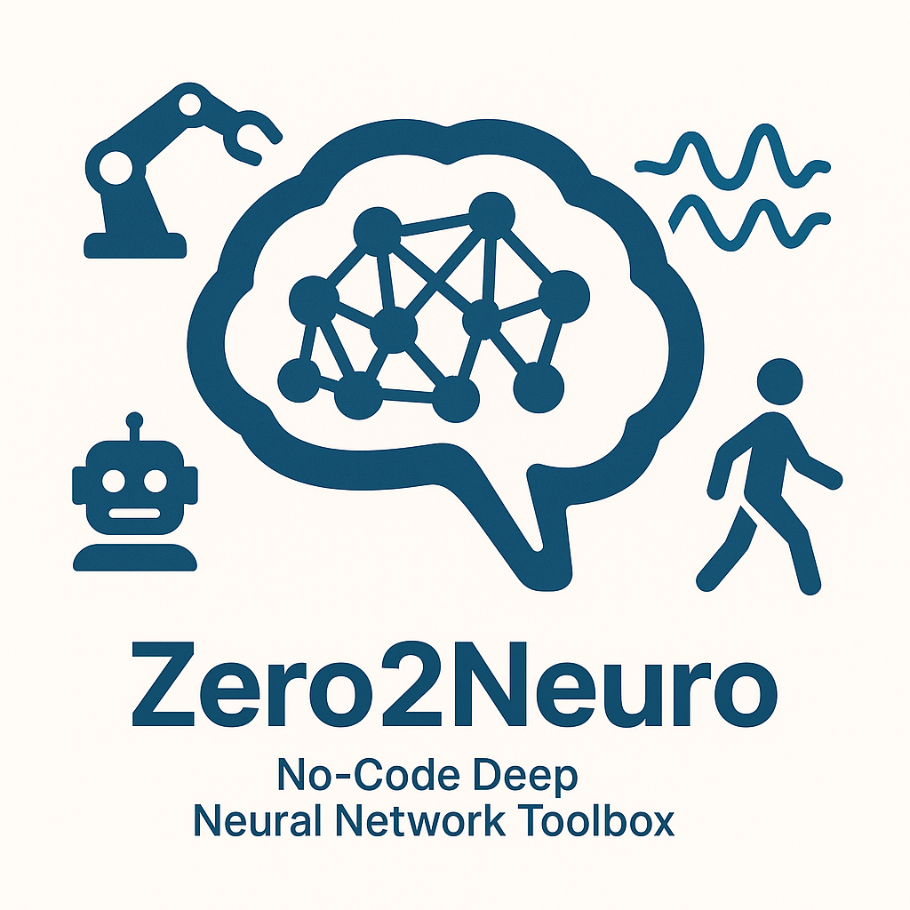

# Zero2Neuro

Zero2Neuro is a no-code solution for constructing, training and
evaluating Deep Neural Network (DNN) models for a wide range of modeling
problems.  This package provides easy-to-use solutions for:

1. Loading data stored in a variety of formats (including the common
Comma Separated Values format), and configuring the data for use in
DNN training and evaluation.

2. Creation of Deep Neural Network models from several flexible DNN
model schemata, including fully-connected networks (FCNs), convolutional
neural networks (CNNs), and U-Nets.  The user specifies the
structural details of their specific model.

3. A standard DNN training and evaluation engine.  This engine
supports the production of result reports in various formats,
including hooks for [Weights and Biases](https://wandb.ai).

## Supported Environments

You can execute Zero2Neuro in several different environments, depending on your needs:

- Bash shell command line
- Supercomputer using SLURM
- Jupyter Notebooks

## Flexible Configuration

The user specifies the details behind their specific DNN experiment
using a set of simple configuration files:

1. Data configuration includes:
	- Location of data files and their type
	- Individual data features to be extracted from the files that
capture the model inputs and desired outputs
	- Translation of data types for categorical variables,
including one-hot encoding
	- Creation of training, validation, and testing data sets

2. Model configuration includes:
	- Model schema
	- Form of the model inputs
	- Number and sizes of model layers
	- Non-linearities for hidden and output layers

3. Training/evaluation engine configuration includes:
	- Learning parameters
	- Loss functions and metrics
	- Early-stopping parameters
	- How experiment results are reported

## Authors
- Luke Sewell
- Andrew H. Fagg (andrewhfagg@gmail.com): Symbiotic Computing
Laboratory, Department of Computer Science, University of Oklahoma
- Mel Wilson Reyes

## Links
- [Requirements](requirements.md)
- [Getting Started](getting_started.md)
- [Examples](examples/index.md)
- [Modules](modules/index.md)
- [Model Configuration](api/index.md)
- [Weights and Biases Support](wandb.md)

