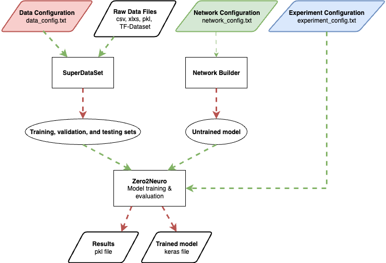

[Base Index](../index.md)   

# Zero2Neuro Modules

  
  
Zero2Neuro is made up of three main modules and instructed by a
corresponding configuration file for each. The three main modules are
SuperDataSet, in charge of preparing data for an experiment, Network
Builder, in charge of making the untrained model, and the Zero2Neuro
engine, which performs the experiment itself. These three modules are
what make Zero2Neuro a zero-code solution as they take care of the
python code by taking in user-defined .txt configuration files.    
  
## Modules
- [SuperDataSet](superdataset/index.md)
- [Network Builder](networkbuilder/index.md)
- [Zero2Neuro Engine](zero2neuro/index.md)

