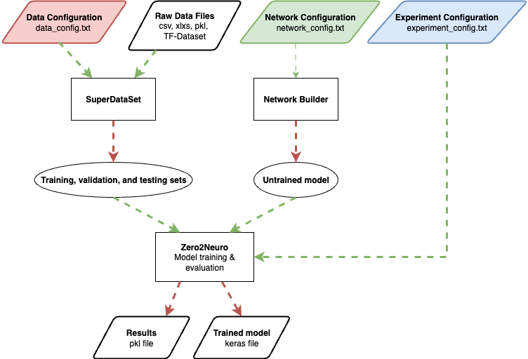

# Zero2Neuro Modules

Zero2Neuro consistis of three primary modules that work together to
allow you to import your data (__SuperDataset__), create your ML model
(__Network Builder__), and conduct
training and evaluation of that model (__Zero2Neuro Training and
Evaluation Engine__).  Each module is configured with
a set of command-line arguments that can conveniently partitioned into
separate configuration text files.

  
  
  
## Modules
- [SuperDataSet](superdataset/)
   - Import one or more files containing data
   - Construct from these data: training, validation, and testing data sets
- [Network Builder](networkbuilder/)
   - Create a deep neural network that implements your model
   - Supported DNN types include:
      - Fully-connected networks (FCNs)
      - Convolutional neural networks (CNNs)
      - Recurrent neural networks (RNNs), including simple RNNs,
Long-Short-Term Memory networks (LSTMs), and Gated Recurrent
Unit-based networks (GRUs)
- [Zero2Neuro Engine](zero2neuro/)
   - Use the training and validation data sets to train the model
until specified criteria are met
   - (Weights and Biases support)[https://wandb.ai] for tracking and
comparing models
   - Evaluation of the trained model against each of the training,
validation, and testing data sets
   - Generation of reports for further analysis
