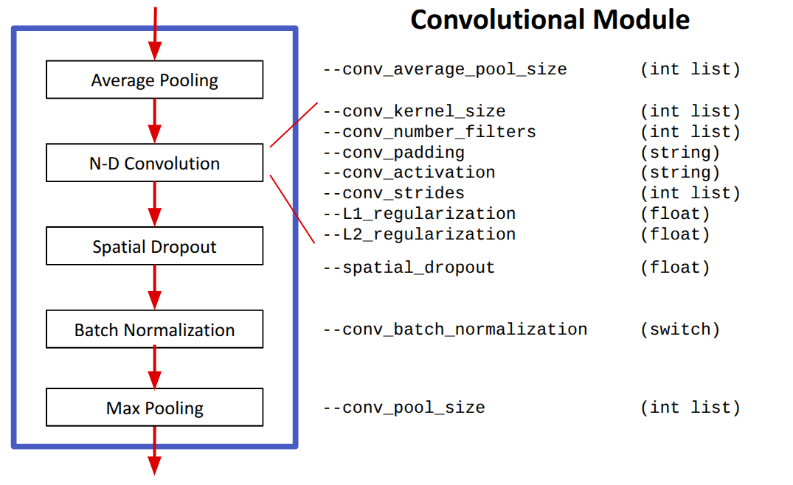
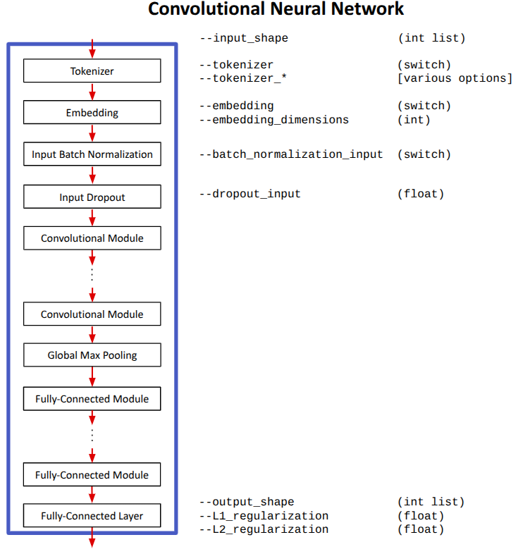

# Convolutional Neural Network Schema Details

Standard Convolutional Neural Networks (CNNs) for classification and regression are nominally composed of a sequence of convolutional layers, followed by an operator that removes spatial/temporal information (e.g., GlobalMaxPooling), and then followed by a sequence of fully-connected layers.  It is typical to surround the convolutional and fully-connected layers with additional components/layers.  The following sections provide the full set of options provided by Zero2Neuro.

## Convolutional Neural Network Module

Each convolutional layer is typically surrounded by a set of optional operators; together, we refer to this sequence as a CNN Module:



Components:
- __Average Pooling__ (optional): computes the average of neighboring cells for each channel
   - ``--conv_average_pool_size`` specifies the number of cells to be averaged as a single integer per module.  For a pooling size of _k_ cells and one-dimensional data, neighboring cells are assembled into groups of _k_, the channel values are averaged across the k cells, resulting in a single output cell (in technical terms, pool size = stride size).  For 2D data, groups of k x k cells are averaged; and for 3D data, groups of k x k x k cells are averaged.  
   - A pool size of k = 0 implies no pooling
- __N-D Convolution__: convolves a kernel of a specified size over the N-dimensional data (where N=1,2, or 3)
   - ```--conv_kernel_size``` specifies the size of the kernel as a single integer per module.  For a specified size of _k_, the convolutional kernel is k, k x k, or k x k x k for 1, 2, or 3 dimensional data, respectively.
   - ```--conv_number_filters``` specifies the number of output filters / channels from this layer.  These filters are independent of one-another.
   - ```--conv_padding``` specifies a string that is either "valid" (default) or "same".  
      - _valid_ implies that the convolutional kernel sweeps only over the input cells, which means that the number of cells in the output is reduced in each dimension by k-1, where k is the kernel size in each dimension.
      - _same_ implies that the number of cells in the output is identical to the number of cells in the input.  This is accomplished by implicitly _padding_ the cells with zero values in each channel.
   - ```--conv_activation``` specifies the activation non-linearity for this layer.
   - ```--conv_strides``` determines how the convolutional kernel slides across the input along each cell dimension (optional); one integer per module.  The default value of 1 implies that that the kernel is aligned with the input at every possible offset.  For a value of 2, the kernel skips every other possible alignment, etc.  
   - L1/L2 weight regularization (default = none): explicit form of regularization that penalizes the absolute value of weights (L1) or the square of the weights (L2).  This penalty is added to the loss function.  Typical choices for L1 are 1 ... 0.001; typical choices for L2 are 0.001 ... 0.00001
- __Spatial Dropout__:
   - ```--spatial_dropout``` (float): during training, randomly deactivate entire filters within the convolutional layer with the specified probability (default = none).  This implements an implicit form of regularization.  A reasonable starting point for this argument is 0.1.
- __Batch Normalization__:
   - ```--batch_normalization``` (switch): scale and shift each output neuron of the module so their values individually fall within a standard normal distribution across a training batch.  While computationally expensive, batch normalization can improve the overall speed of training for very deep networks. Default: none.
- __Max Pooling__: compute the maximum of each channel within groups of cells
   - ```--conv_pool_size``` specifies the number of cells to be grouped as a single integer per module.  For a pool size of _k_ cells and one-dimensional data, neighboring cells are assembled into groups of _k_, a maximum is computed over each channel across the k cells, resulting in a single output cell (in technical terms, pool size = stride size).  For 2D data, groups of k x k cells are used; and for 3D data, groups of k x k x k cells are used.  
   - A pool size of k = 0 implies no pooling

- __NOTES__: 
   - The length of the integer lists determines the number of convolutional modules.
   - If the integer lists are not the same length, then they are all truncated to be the length of the shortest list.  The exception is that if the default value for the convolutional strides is used, then it is ignored for the purposes of truncation.


## Fully-Connected Module
A Convolutional Neural Network also makes use of [Fully-Connected Modules](fully_connected_details.md).

## Convolutional Neural Network

The full Convolutional Neural Network has the following structure:



Components:
- __Inputs__: 
   - ```--input_shape``` specifies the shape of the network input: one integer per cell dimension + one integer specifying the number of channels in the input.
- __Tokenizer__: translation from an input string to a sequence of integers.
   - ```--tokenizer``` turns on tokenization.
   - For this feature, the input shape must be (1,)
- __Embedding__: translates a sequence of integers into a sequence of vectors.
   - ```--embedding_dims``` (int): length of the individual vectors.
- __Batch Normalization__ (switch): Normalize the input feature values
   - ```--batch_normalization_input``` (switch): Turn on batch normalization for the input features.
- __Input Dropout__: randomly drop out input features during training.  This can help the network to learn representations that rely on different subsets of input features.
   - ```--dropout_input``` (float): Dropout probability (0..1).
- __Convolutional Modules__
- __Global Max Pooling__: remove cell dimensional data by computing the maximum value across all cells within each channel.  If the output of the convolutional modules has a shape of (d0, d1, d3, k) (i.e., 3D data + k channels), then the output of this layer has a shape of (k,).
- __Fully-Connected Modules__
- __Fully-Connected Layer__: Final output layer
   - ```--output_shape``` (int sequence): The shape of the network output.
   - L1/L2 weight regularization (default = none): Same as for the Convolutional and Fully-Connected Modules.

## References
   - [Fully-Connected Modules](fully_connected_details.md).
   - [Tokenization and Embedding](tokenization_embedding.md)
   - [Input Batch Normalization](input_batch_normalization.md)

