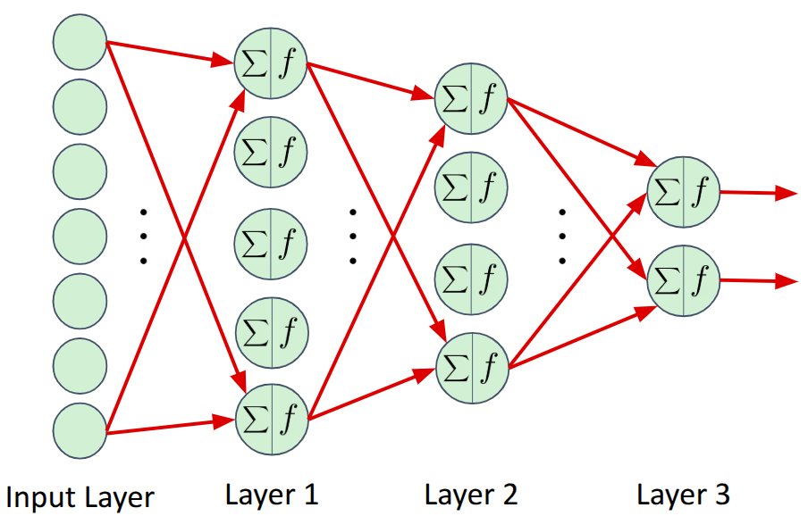

# Fully Connected Neural Networks
A fully connected neural network is one in which:
1. There is a sequence of neural layers.
2. Each neuron in one layer provides input to each neuron in the next layer.

The _network configuration file_ typically specifies:
- The network architecture
- The number of input units
- The number of hidden layers and the number of neurons within each
- The non-linear activation function for the hidden layers
- The number of output units and the corresponding non-linear activation function

## Example Network
Here is an example network with one input, two hidden, and one output layer:



The corresponding network configuration file:

```
# Fully connected network
--network_type=fully_connected

# Seven inputs
--input_shape
7

# Two hidden layers
--number_hidden_units
5
4
--hidden_activation=elu

# Two output units
--output_shape
2
--output_activation=sigmoid
```

Configuration file notes:
- Blank lines are ignored.
- Any characters following '#' are considered comments and are ignored.
- The ```--input_shape``` argument specifies an input vector of size 7
- The ```--number_hidden_units``` argument specifies the number of layers and the number of neurons in each layer, in sequence.  In this case, there are two hidden layers of size 5 and 4 neurons are specified.
- The hidden layer activation function is _elu_ for all hidden layers.
- The ```--output_shape``` argument specifies an output vector of size 2.
- The output activation function is _sigmoid_ (output range of [0,1]).

## Constraints
- The input_shape must be the same shape as the input data.
- The output_shape (typically) must also be the same shape as the desired outputs.

## Extensions
1. Hidden layers: Any number of hidden layers (and corresponding sizes) can be specified using the ```--number_hidden_units``` argument
2. Output layer: The output can be of any shape (e.g., a 2D matrix, or a N-D tensor), as long as this shape is the same as the data.

## Fully-Connected Neural Network Examples
- Regression: 
   - [Exclusive OR Logic Function](../../../examples/xor/README.md)
- Classification: 
   - [Iris Shape Classification](../../../examples/iris/README.md)

## More Details (Intermediate)
- [Fully-Connected Neural Network Details](fully_connected_details.md)
