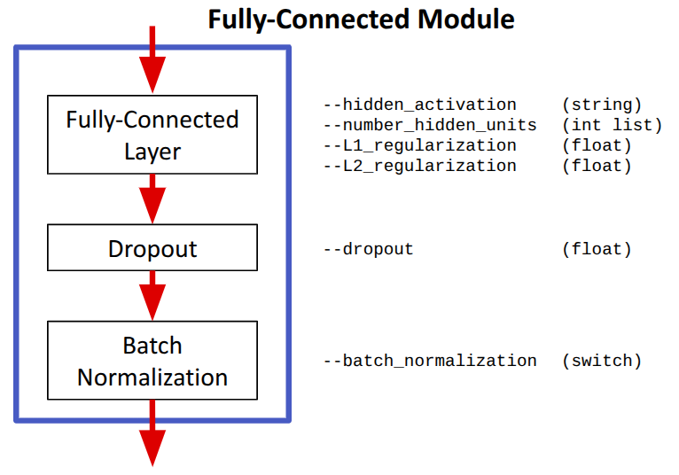
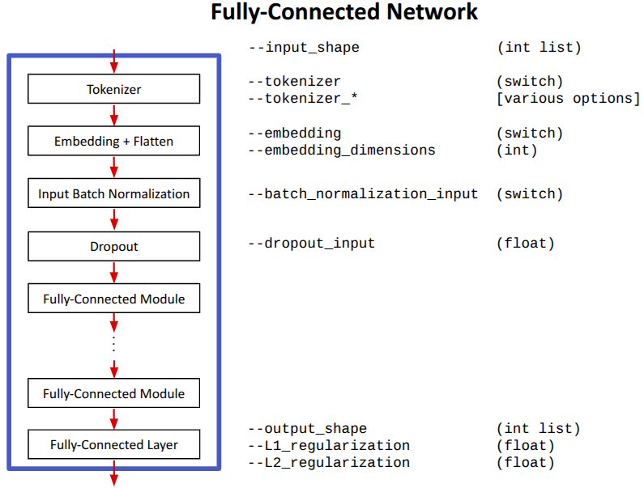

# Fully-Connected Network Schema Details
A fully-connected network (FCN) is composed of a sequence of fully-connected layers (also referred to as __Dense layers__), followe by an output layer.  However, there are many other components that can be added to these networks to improve their performance or to expand the types of problems that can be solved.  In this section, we present the details of the Zero2Neuro Fully Connected Schema and show how the different components can be configured using network arguments.


## Fully-Connected Module
The base of a FCN is implemented using a seqeunce of fully-connected modules, which add functionality on top of Fully Connected Layers:



Components:
- __Fully Connected Layer__ (also referred to as a __Dense Layer__): a layer that contains the specified number of hidden neurons; each receives input from all neurons in the previous layer.
   - ```--hidden_activation```: non-linear activation function
   - ```--number_hidden_units```: number of hidden units in the layer
   - L1/L2 weight regularization (default = none): explicit form of regularization that penalizes the absolute value of weights (L1) or the square of the weights (L2).  This penalty is added to the loss function.  Typical choices for L1 are ~1; typical choices for L2 are 0.001 ... 0.00001
- __Dropout__: during training, randomly deactivate neurons within the layer with the specified probability (default = none).  This implements an implicit form of regularization.
- __Batch Normalization__: scale and shift each output neuron of the module so their values individually fall within a standard normal distribution across a training batch.  While computationally expensive, batch normalization can improve the overall speed of training for very deep networks. Default: none.

Notes:
- All arguments are shared across all Fully-Connected Modules in the network, with the exception that each has its own number of neurons (```--num_hidden_units``` accepts a list of hidden neuron numbers, one for each layer).

## Fully-Connected Network


Components
- __Inputs__: shape specified by ```--input_shape```
- __Tokenizer__: translation from an input string to a sequence of integers
   - ```--tokenizer``` turns on tokenization;
- __Embedding + Flatten__: translates a sequence of integers into a sequence of vectors which are then appended together to form one large vector
   - ```--embedding_dims``` (int): length of the individual vectors
- __Batch Normalization__ (switch): Normalize the input feature values
   - ```--batch_normalization_input``` (switch): Turn on batch normalization for the input features.
- __Input Dropout__: randomly drop out input features during training.  This can help the network to learn representations that rely on different subsets of input features.
   - ```--dropout_input``` (float): Dropout probability (0..1)
- __Fully Connected Layer__: Final output layer
   - ```--output_shape``` (int sequence): The shape of the network output
   - L1/L2 weight regularization (default = none): Same as for the Fully-Connected Modules.

References:
   - [Tokenization and Embedding](tokenization_embedding.md)
   - [Input Batch Normalization](input_batch_normalization.md)

