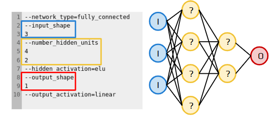

# Network Building

## Building A Neural Network
In order to build a neural network you need to describe the parameters of your architecture in a network_config.txt file. Inside of this file is where you specify the parameters of your network such as number of hidden layers, activation functions, and amount of nodes in each layer.


## Activation Functions
Activation functions are what introduce non linearity to the functions your model makes. There are a variety of activation functions such as ReLU, ELU, and sigmoid. Each of these has its own purpose and it is important to change depending on what the experiment is. For instance, sigmoid forces a range between 0-1, which corresponds with a percent between 0% to 100% and makes sigmoid a valuable function for binary classification problems.  
  
## Fully Connected Networks  
  
If the user specifices they want a fully connect network network builder takes in these arguments and creates a fully connected network architecture.
  
```
--input shape0  
--number_hidden_units    
--output_shape0  
--dropout_input  
--hidden_activation  
--L1_regularization  
--L2_regularization  
--dropout  
--output_activation  
--batch_normalization  
--learning_rate  
--loss  
--metrics  
```
  
For more information on what these arguments do: [Arguments List](../../api/args_list.md)  
  
## Convolutional Neural Networks

Like with fully connected networks, network builder takes in user-defined arguments and makes a CNN but with more arguments added such as...
  
```  
--conv_kernel_size  
--conv_padding  
--conv_number_filters  
--conv_activation  
--conv_pool_size  
--conv_strides  
--spatial_dropout  
--conv_batch_normalization  
```

For more information on what these arguments do: [Arguments List](../../api/args_list.md)