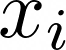
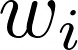
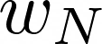
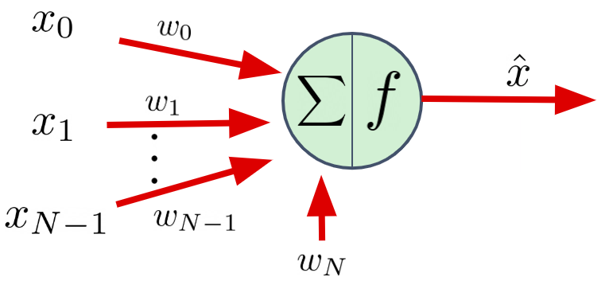
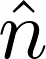
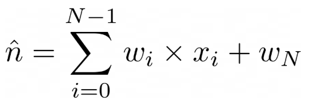
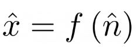
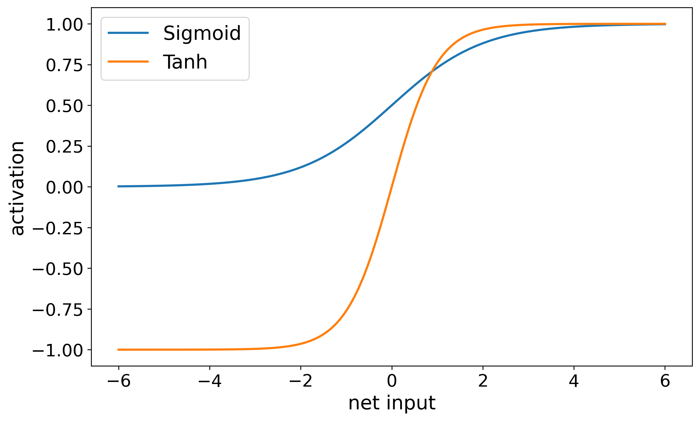
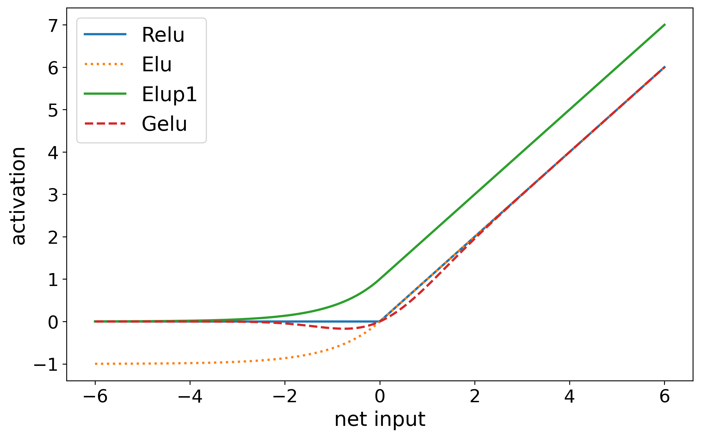

# Neural Networks Tutorial

## Individual Neurons

The fundamental unit in a deep neural network is the individual neuron.  The neuron receives N continuous (real numbered) inputs 
() 
that each have their own weight 
().  
In addition, each neuron includes its own bias term
().

The neuron computes its state in two stages:
1. The net input 
() 
into the neuron is a weighted sum of the inputs and the bias:

2. The net input into the neuron is (typically) transformed using a nonlinear activation function of the following form:

## Non-Linearities
Non-linearities are key to the utility of deep neural networks.  The choice of non-linearity varies depending on the type of problem that is being solved.  

Traditional non-linear activation functions include:
- sigmoid: the output range falls within [0,1].  This can be interpretted as a probability.
- tanh (hyperbolic tangent): similar shape as signmoid, but has a symmetric output range of [-1,1].

Other common non-linear activation functions (often used for regression) include the following:
- relu has an output range of [0, infinity], and is piecewise-linear (with no derivative at zero).
- elu has an output range of [-1, infinity] and has a similar shape as relu, except that it has a non-zero derivative throughout the input domain (though the derivative becomes very small to the left)
- elup1 (elu plus 1; a custom Zero2Neuro non-linearity) has an output range of [0, infinity]
- gelu has an output range of [-.17, infinity]

Full documentation for available non-linear activation functions can be found in the [Keras Activation Function Documentation](https://keras.io/api/layers/activations/).
___
## Collections of Neurons
The power of deep neural networks comes from the assembly of many individual neurons into _layers_ and multiple layers into a much larger network.  The following is an example __fully connected network__:

- There are 7 neurons that comprise the input to the network.  The continous value associated with each of these neurons is supplied from "outside" the network.  One can think of the group of inputs as a 7-element vector.
- Each input neuron is connected to each neuron in _Layer 1_.  These connections all have their own set of parameters (a total of 7x5 + 5 weights and biases, respectively).
Likewise each neuron in _Layer 1_ is connected to _Layer 2_, and each in _Layer 2_ is connected to each of _Layer 3_.
- _Layer 3_ contstitutes the output of the network.  Because there are two neurons in the output layer, we can think of the network as generating a 2-element vector as the output.
- The network training process typically involves the use of a set of known input/desired output pairs (i.e., the input and what the network _should_ output in response).  
   - When there is a disagreement between what the network actually produces as output and the desired values, the parameters are adjusted to reduce this disagreement.
   - The input/desired output pairs do not explicitly determine how the neurons in intermediate layers (1 and 2) should respond to inputs.  For this reason, these layers are often referred to as _hidden layers__.  The network training process infers how these neurons should "behave" in service to producing the correct output values.
- It is typical to choose different non-linear activation functions for the hidden layers and the output layer.  The latter is often chosen to match the output range of the desired outputs.
- The neurons within any given layer are independent of one-another: they have their own weights and biases.  A notable exception is the _softmax_ activation function that takes into account the net input for all of the neurons in the layer when computing the output activation for each neuron.

___
## Generalizations
Network input / outputs do not have to be single vectors as shown in the example above.  For example
- An image can be represented as a 2D field of vectors (with each pixel containing a vector that represents the red, green, and blue components of a color).
- A timeseries is a 1D field of vectors (e.g., x,y,z of some object over time).
- A movie is a 3D field of vectors (2 spatial dimenstions + 1 time dimension of color vectors).
- A sentence is a 1D field of tokens.

Choosing your network architecture, including
the number and dimensionality of your inputs and outputs, as well as the non-linear activation functions of your hidden and output neurons, depends on the nature of your data and on the type of problem that you are trying to solve.
___

## Loss Functions
The _loss function_ is a function that measures the degree of error between the output of the network and the corresponding desired output.  

Typical loss functions for regression include:
- Mean squared error (mse).  This is the same loss function that is used by traditional linear regression.
- Mean absolute error (mae).

Typical loss functions for classifier networks include:
- Binary cross-entropy.
- Categorical cross-entropy.
- Sparse categorical cross-entropy.
