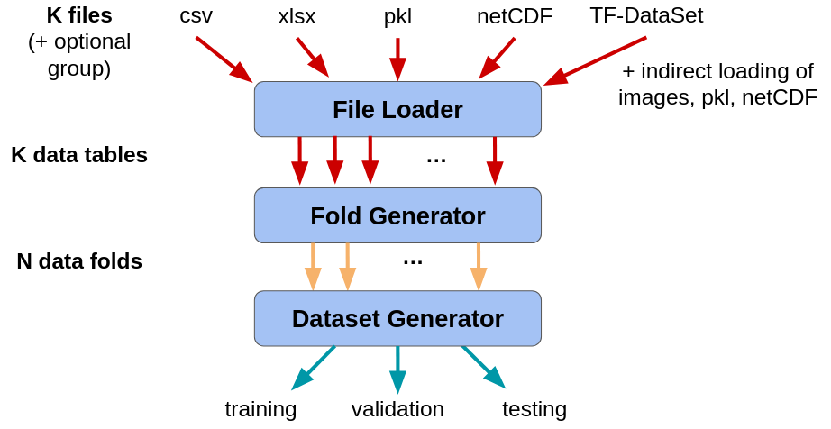

# Splitting Data into Folds

The translation from a set of files to the training/validation/testing
data sets is handled as a multi-step process, with two intermediate
representations: _data tables_ and _data folds_.  Both intermedidate
representations include all of the input/desired output examples, but
serve different purposes in the model training process.  

The translation process is as follows:

1. __File Loader__: Each data file is loaded into a single _data
table_.  Each table consists of multiple input/desired output
examples.

   a. Optional: each data table may be tagged as belong to a specific
fold.

   b. Optional: each example within a table may be tagged as belonging
to a specific fold.

2. __Fold Generator__: the examples contained within the data tables
are sorted into one or more _data folds_.

   a. By default, one data table is assigned to one fold.

   b. The examples may also be sorted by how they are tagged.

3. __Dataset Generator__: Assembles training/validation/testing data
sets by combining discrete data folds.  Specifically:

   a. The training set is one or more folds

   b. The validation set is zero or one fold

   c. The testing set is zero or one fold

   d. The exact assignment is determined by several different data set
options.

## Constructing Folds

## Constructing Data