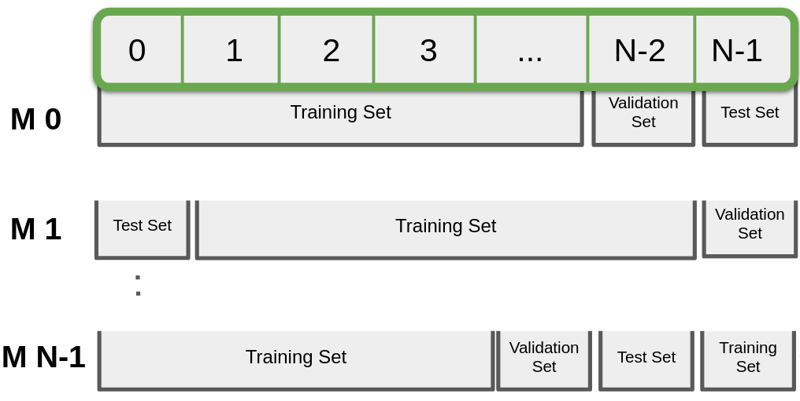
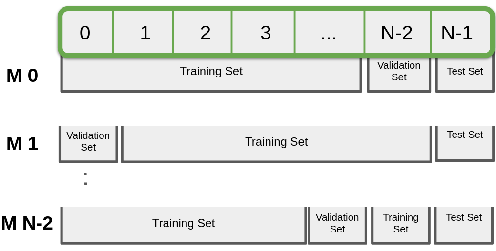

# Data Set Generator
The data set generator is responsible for assigning folds (as atomic
units) to the training, validation, and testing data sets.  The
specific approach that is used depends on the structure of the data
and the specific experimental question that is being asked.  This
approach is selected using the _--data_set_type_ argument.

Informal experiments might involve the training and evaluation of an
individual model.  However, to be statistically valid, one must be
able to show that the modeling approach works consistently when
trained and evaluated using different data sets.  One formal approach
is to choose a Cross-Validation method.

## Fixed Assignment (Beginner)
With fixed assignment, single folds are directly mapped to data sets.

```
--data_set_type=fixed
```


- Fold 0 is assigned to the training data set
- Fold 1 (if it exists) is assigned to the validation data set
- Fold 2 (if it exists) is assigned to the testing data set
- An error will be raised if there are more than three folds

This approach is typically used for quick, informal experiments that
may just have a training set.  

___

## Holistic Cross-Validation (Intermediate)

N-fold Cross-Validation is about using N data folds to create N
different models using different subsets of folds as training,
validation, and testing data sets.  By default, any given model will
be trained with N-2 folds, with the remaining folds being used for
validation and testing, respectively.  From one model to the next, we
rotate through the assignments of the folds to the training,
validation, and testing data sets, as shown:



Here, model M0 (corresponding to rotation 0) makes use of folds
0...N-3 (inclusive) for training; fold N-2 for validation; and fold
N-1 for testing.  For rotation 1, this assignment shifts by one fold:
folds 1...N-2 are used for training; fold N-1 for validation; and fold
0 for testing.

Holistic cross-validation and rotation 3 are selected in the
configuration file as follows:

```
--data_set_type=holistic-cross-validation
--data_rotation=3
```

Key to N-Fold Holistic Cross-Validation is that through all rotations,
each fold is used exactly once as validation data and as testing
data.  This implies that model testing performance across all N
rotations can (mostly) be assumed to be independent statistics (the
models themselves are not technically independent since they rely on
overlapping training sets).

___

## Hold-Out N-1 Fold Cross-Validation (Intermediate)

This form of cross-validation is similar to holistic cross-validation,
with two key differences:
- Fold N-1 is always used as testing data
- There are only N-1 rotations possible



This form of cross-validation is configured as follows:
```
--data_set_type=hold-out-cross-validation
--data_rotation=3
```

This form is more typically seen in modern discussions of
cross-validation.  However, because testing performance across all
rotations is measured with the same fold, one must take this into
account when using hypothesis testing (specifically, the the
performance metrics are not independent samples).

___

## Cross-Validation Variations (Advanced)

### Training Data Set Size

The default for all cross-validation methods is for the training data
set to be composed of all possible (N-2) folds.  However, one can
explicitly set the number of folds:

```
--data_n_training_folds=DD
```
where DD is some number of folds.

This argument is useful when one is examining the sensitivity of the
model with respect to the size of the training set.

### Validation Data Set

The default is for the validation data set to be exactly one fold.
This can also be changed:
```
--data_n_validation_folds=DD
```

When the folds contain a small number of examples, training can be a
bit more stable when the validation set is larger than a single fold.

Note: 
- The sum of training folds and validation folds cannot exceed N-1

### Training Many Models

While one can systematically train one model at a time (one for each
rotation), it is also possible when using SLURM on a supercomputer to
train all N models effectively in parallel.   

References:
- [Getting Started on the OU Supercomputer](../../getting_started/environment_ou_supercomputer.md)
- [Cartesian Experiments](../experiments/cartesian_experiments.md)
