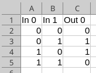

# Data Loading Examples, Part 1

## Examples
How the data are loaded into memory and organized into training,
validation, and testing sets is defined by a _data configuration
file_.  Below are several example use cases for these configuration
files. 

Data sets can be represented using a variety of file formats.  One
common tabular format is the Comma Separated Values (CSV) file.  
In any tabular format, rows are individual examples and different columns
can contain either input features or desired output values.

For the [Exclusive OR Problem](../../../examples/xor/README.md), we have a
total of four different input/output examples.

Example file: [xor_data.csv](../../../examples/xor/xor_data.csv)

File content: <BR>


This particular file represents two different inputs, called "In 0"
and "In 1" (the internal spaces are okay to use), and one desired
output: "Out 0".  Note that in general, tabular files may represent
any number of input features and desired outputs.

### Training Data Set Only
The following data set specification file for the XOR problem
specifies:
- The file format is tabular
- The name of the input data file (xor_data.csv)
- That the one input file should used as just as a training data set
- The list of columns to be used as input features
- The list of columns to be used as corresponding desired outputs

```
--data_format=tabular
--data_file=xor_data.csv
--data_set_type=fixed
--data_inputs
In 0
In 1
--data_outputs
Out 0
```

Notes:
- The specified input and output names must match those in the CSV
file.
- Do not include extra spaces in the configuration file.

### Training, Validation, and Testing Data Sets from Multiple Files
Multiple input files may be used.  When there are three files and
_data_set_type_ is _fixed_, then data_A is used as training data,
data_B is used as validation data, and data_C is used as testing data.

```
--data_format=tabular
--data_files
data_A.csv
data_B.csv
data_C.csv
--data_set_type=fixed
--data_inputs
In0
In1
--data_outputs
Out0
Out2
Out3
```
