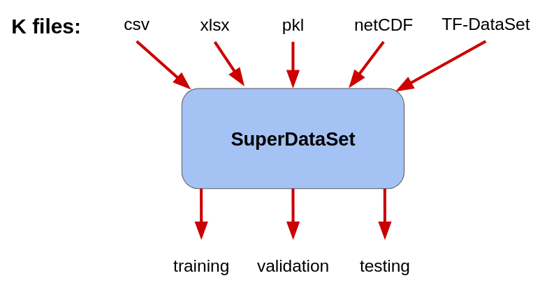
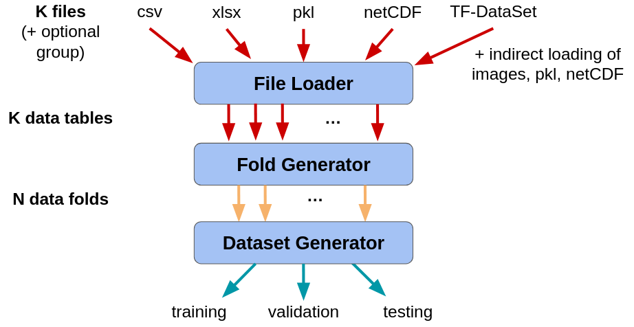

# SuperDataSet

**SuperDataSet** is responsible for loading your data and configuring it
for a training/evaluation experiment. We support a range of file
formats and configuration options.

## Data Sets
A data set for machine learning is composed of a set of examples.
Often, a single example is composed of an input/desired output pair,
meaning that for a given numerical input, the ideal model will produce
the desired output.  For any machine learning experiment, it is
important to distinguish between several different data set types:

- **Training data sets** are used to adjust the parameters of a
model.  In the deep network context, these parameters are adjusted
incrementally to gradually reduce the prediction errors made by the
model on the training data set.

- **Validation data sets** are independent of the training set and are
used to:
   1. Evaluate the performance of a model at each training step.  This
information is often used to detech when training is complete.
   2. Compare the model to itself under different choices of
hyper-parameter sets.

- **Test data sets** are independent of both the training and
validation data sets,  and act as a simulation of possible future data
sets.   As such, a test data set is used only for the final evaluation
of a model *after* hyper-parameter choices are made.

## Stochastic Nature of Machine Learning Training and Evaluation

The training of machine-learned models is a stochastic process due to
a range of factors, including:
- the selection of the data used for training, validatin, and testing,
- the initial choices for the model parameters (which are randomly
selected), and 
- random factors during the training process (e.g., random assignment
of examples to training batches, or Dropout).

The consequence of these random processes is that when we train a
model multiple times (even when we think the conditions are the same),
the performance of the model (e.g., accuracy) can vary to some degree.  Using
statistical language, we say that the performance is a _random
variable_.  In practice, this means that training and evaluating a
model cannot be done just once - if we want to show that a model is
doing its job and doing it well, then we must show that it does so
consistently under different training and evaluation conditions.

SuperDataSet provides support for a range of different ways of
constructing data sets, depending on what your goals are - all the
way from only using a training set for a quick, informal exaperiment,
to assembling multiple training, validation, and testing data sets to
be used for formal evalution, including _Cross-Validation_.

___
## Examples

___

## From Data Files to Data Sets

The translation from a set of files to the training/validation/testing
data sets is handled as a multi-step process, with two intermediate
representations: _data tables_ and _data folds_.  Both intermedidate
representations include all of the input/desired output examples, but
serve different purposes in the model training process.  

The translation process is as follows:

1. __File Loader__: Each data file is loaded into a single _data
table_.  Each table consists of multiple input/desired output
examples.

   a. Optional: each data table may be tagged as belong to a specific
fold.

   b. Optional: each example within a table may be tagged as belonging
to a specific fold.

2. __Fold Generator__: the examples contained within the data tables
are sorted into one or more _data folds_.

   a. By default, one data table is assigned to one fold.

   b. The examples may also be sorted by how they are tagged.

3. __Dataset Generator__: Assembles training/validation/testing data
sets by combining discrete data folds.  Specifically:

   a. The training set is one or more folds

   b. The validation set is zero or one fold

   c. The testing set is zero or one fold

   d. The exact assignment is determined by several different data set
options.

### Internal Representation

Internally, data tables, data folds, and training/validation/testing
data sets are represented internally in one of two ways:

1. __Numpy Arrays__ are appropriate for small data sets that can be
contained entirely within the available RAM.  This representation
offers the most flexibility in how data are handled.

2. __Tensorflow Datasets__ represent data sets as data processing
pipelines.  These are most appropriate for large data sets, especially
those that are expensive to load from disk.  This option allows for
training of models to begin before all data are loaded from disk, and
allow caching of data to high-speed storage.

___

## Data Files

[Data File Types](data_files.md)

Low-level details
- [Data Translation](data_translation.md)
- others?

___
## Files to Folds

Separate file?

Grouping files into folds

- **Identity**

- **Group-by-File**

- **Group-by-Example**

- **Random** 

- **Random-Stratify**

___
## Folds to Data Sets

Separate file?

- **Fixed** 

- **Holistic-Cross-Validation**

- **Hold-Out-Cross-Validation**

- **Orthogonalized-Cross-Validation**

