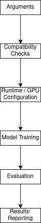

  
# Zero2Neuro Engine

## Description
The Zero2Neuro engine is in charge of the full machine learning experiment flow  by using the datasets given by SuperDataSet and the given network architecture. It is responsible for training, evaluation, reporting, and checkpointing.

## Experiment Flow

## Core Features
- training
- validation/testing
- metric collection
- experiment reporting

Execution is called by:
- `prepare_and_execute_experiment()` Prepares experiment
- `execute_exp()` Executes model training

## Data Pipeline

Two internal representations are supported for model training:
  
- TF-Datasets (pipeline)
- NumpPy Arrays (in memory)

For more information [Data Representation](../superdataset/data_representation.md)

## Runtime Configuration

The engine manages runtime configuration which includes:

- GPU usage
- GPU memory growth
- CPU threading limits

If GPU usage is disabled inside of the arguments they are hidden and the execution will fall back onto CPU-only. 

## Links
- [Training A Model](training_model.md)
- [Saving Result](saved_results.md)
- [Weights&Biases Suport](wandb.md)