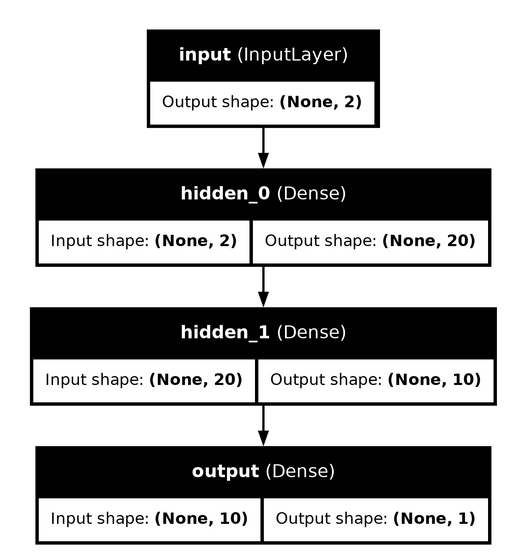

[Base Index](../../index.md)  
[Previous Index](index.md)  
  
# Training A Model
  
## Setting up Experiment  
The Zero2Neuro Engine is the last module in the Zero2Neuro pipeline. It takes in the data from SuperDataSet, the untrained model from Network Builder, and uses the arguments from the experiment_config.txt file. There are a variety of customization options for experiments built in.  
  
### GPU Support  
If you want to use a gpu all you need to do is add ```--gpu``` to your experiment_config.txt file. If the program finds a gpu on the computer you run this on it will utilize it for the experiment.  
  
### Verbosity Level  
In Zero2Neuro we use an argument called verbosity in order to either minimize or maximize the information the user sees. This will give you details about your model with ```--v``` being the lowest and ```--vvv``` being the highest.  
  
### Debugging Level
Debugging is similair to verbosity but focuses more on troubleshooting errors and more in-depth error messages. Like with verbosity it is called by ```--d``` or ```--ddd``` with the latter being the highest level.  
  
### Rendering Model  
If you wish to have a .png image of your model's structure add ```--render_model``` to your experiment_config.png  
  
  
   
### Weights & Biaes  
There is built in support for weights and biases if you sign into your WandB account. To enable this feature just call the ```--wandb``` argument and it will log the experiment. You can also do ```--wandb_project``` to name the wandb projects.  
  
## Running The Experiment  
The engine takes in all of these arguments, the training/validation/testing sets, the untrained model, and runs the experiment for the model.  
