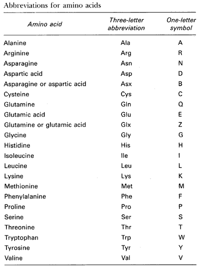

# Example: Estimating Peptide Binding Affinity from Amino Acid Sequences

Peptides are short chains of amino acids that perform a wide range of
biological functions, depending on the specific sequence of amino
acids. Understanding how amino acids interact with other molecules is
key to understanding the mechanisms of genetic diseases and to
constructing therapies to address these diseases.  

One form of interaction is the question of how well a peptide binds to
a specific molecule (this is known as binding affinity). For this
assignment, we will use a data set that includes a measure of binding
affinity for a large number of peptides toward the molecule
HLA-DRB1*15:01. Our goal is to predict the binding
affinity for novel peptides.

## Amino Acids

A total of 22 amino acids make up the building blocks for all peptides
and proteins. The following table gives the names and one-letter codes
used to represent these amino acids:  





## Data

We include one example dataset file: [1501_fold1](dataset/train_1501_fold1.csv) 
This CSV file includes three columns:
1. String of amino acids.  String lengths can vary by example
2. Scaled binding strength (0 ... 1)
3. (added) Binary class: binds well (1) or not (0)

## Data Configuration

[Data Configuration File](data.txt)

Notes
- The CSV file does not include header names, so these are supplied in the configuration
- Because the example inputs are strings, we must take two preprocessing steps (could be defined here or in the network configuration):
   1. Tokenization: translate a string into a sequence of integers
      - Split by individual characters since they map to individual amino acids
      - We define the maximum number of unique tokens (we happen to know that this is 24).  Each unique token is assigned a unique integer prior to the learning process (based on the training data set); tokens are include a "no value" and an "unknown value" token.
      - We declare the maximum number of tokens in the sequence (30)
   2. Embedding: translate token integer into a vector
      - Embedding dimensions is the size of the vector
      - This mapping is learned during model training

## Prediction with Temporal or Spatial Data

For data that are gridded in time or space, the relative positions of
the tokens can be important for predicting some value.  For this Amino
Acid example, a specific subsequence of amino acids can result in a
necessary functional component of the peptide in terms of its ability
to bind to the HLA-DRB1*15:01 molecule.  And, where in the
peptide this subsequence occurs may or may not affect the binding
affinity.  It is therefore often important to choose models that
explicitly model the spatial/temporal nature of the data.

## Networks

We provide several different network architectures to demonstrate the
range of models that are possible:

- [Fully connected network](network.txt): this architecture throws out
all of the spatial information contained within the string.  As a
result, the model must learn all possible locations for important
subsequences.
- [Convolutional Neural Network](network_cnn.txt): this implementation
is composed of four convolution modules, followed by three fully-connected
hidden layers.
- [Simple Recurrent Neural Network](network_rnn.txt): includes a
single RNN layer of 60 recurrent neurons.  This is followed by three
fully-connected hidden layers.
- [Deep Simple Recurrent Neural Network](network_rnn_complex.txt): two
RNN layers (60 and 40 units, respectively).  The first layer produces
an output vector for every token; the last layer produces only an
output vector at the end of the tokens.  This model also includes 
- [GRU Recurrent Neural Network](network_gru.txt): GRU RNNs tend to
train faster than Simple RNNs.  This network has three RNN layers (60,
50, 40 neurons).
- [LSTM Recurrent Neural Network](network_lstm.txt): Like GRU RNNs,
LSTMs tend to train faster than Simple RNNs.  

## Experiment Configuration
The [experiment configuration file](experiment.txt) provides default
experiment control parameters.  Note that some of these are overridden
by other configuration files (e.g., some networks require different
configuration choices).

## Executing an Experiment

Basic invocation:
```
python $ZERO2NEURO_PATH/zero2neuro.py @data.txt @experiment.txt @network.txt -vvv --force
```

where network.txt can be substituted for any of the above network
configuration files.

## Switching to a Classification Problem
By default, the above data and network configuration files set up a
problem of regression, where the model is to predict the non-negative
scaled binding affinity value.  We can change the problem into one of
classification using the
[classification_override.txt](classification_override.txt) as follows:

```
python $ZERO2NEURO_PATH/zero2neuro.py @data.txt @experiment.txt @network.txt @classification_override.txt -vvv --force
```

## References
- [Paper: Improved methods for predicting peptide binding affinity to MHC class II molecules](https://onlinelibrary.wiley.com/doi/10.1111/imm.12889)
- [Original Data Set](https://services.healthtech.dtu.dk/services/NetMHCII-2.3/)

___
## Bonus Example: TF-Datasets

The data set described above is represented in Zero2Neuro as a numpy
array.  The alternative to this representation is a TF-Dataset, which
is more structured, but can be much more efficient when loading the
data from disk and managing it in RAM.  These efficiencies are
particularly visible when the data set is very large (even large
enough to not fit entirely in the available RAM).  

In the following example, we translate the Amino Acid dataset from CSV
format to TF-Dataset format.  As part of this process, we first split
the CSV dataset into 10 folds before saving each fold separately in a
TF Dataset file format.  These folds can then be reassembled later to
form the training, validation, and testing data sets on the fly.


### Translate the input amino acid tabular data into a set of TF Dataset folds.

1. Create the local 'ds' directory:
```
mkdir ds
```

2. Generate the folded data without performing an experiment

```
python $ZERO2NEURO_PATH/zero2neuro.py @data.txt @experiment.txt @network.txt  -vvv --data_save_folds ds/amino --nogo
```

Notes:
- --data_save_folds indicates where the TF_dataset directories should
be placed.  These are placed in ds/amino_fold_00.ds,
ds/amino_fold_01.ds, ...  Each is a directory with a small number of
files
- --nogo means that only the data are saved and no training is
performed during this extraction


### Use the TF-Dataset files instead of the raw amino acid file

The key difference is that we now use an alternative data
configuration file: [data_tf.txt](data_tf.txt):

```
python $ZERO2NEURO_PATH/zero2neuro.py @data_tf.txt @experiment.txt @network.txt -vvv
```
___
